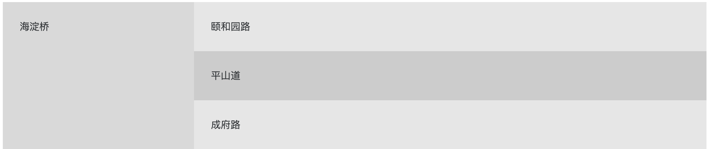

<!-- @format -->

[返回布局](./README.md)

## 布局解析


页面整体由顶部导航栏、左侧导航栏、页签、主体内容四部分组成。

我们使用了布局组件 layout 来完成布局。

如同下图组件示例方式布局:



代码实现如下：

```html
<n-layout has-sider>
  <n-layout-sider content-style="padding: 24px;"> 海淀桥 </n-layout-sider>
  <n-layout>
    <n-layout-header>颐和园路</n-layout-header>
    <n-layout-content content-style="padding: 24px;"> 平山道 </n-layout-content>
    <n-layout-footer>成府路</n-layout-footer>
  </n-layout>
</n-layout>
```

先通过一个 has-sider 的 layout 完成了左侧导航栏的布局。

然后在 layout 内部嵌套了一个 layout，完成了顶部导航栏和主体内容的布局。

[研究一下布局组件](https://www.naiveui.com/zh-CN/os-theme/components/layout)


